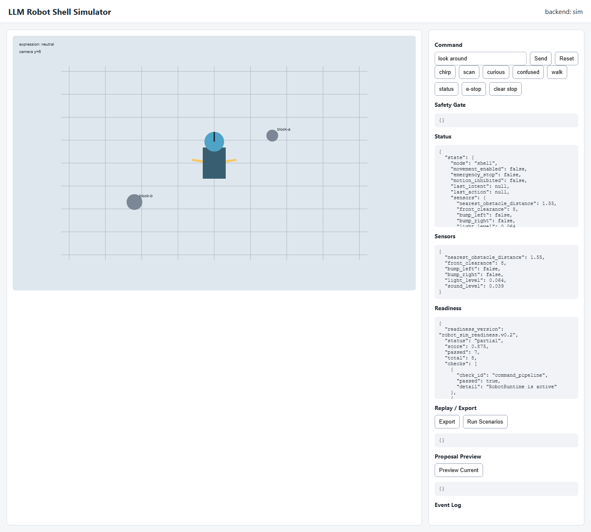
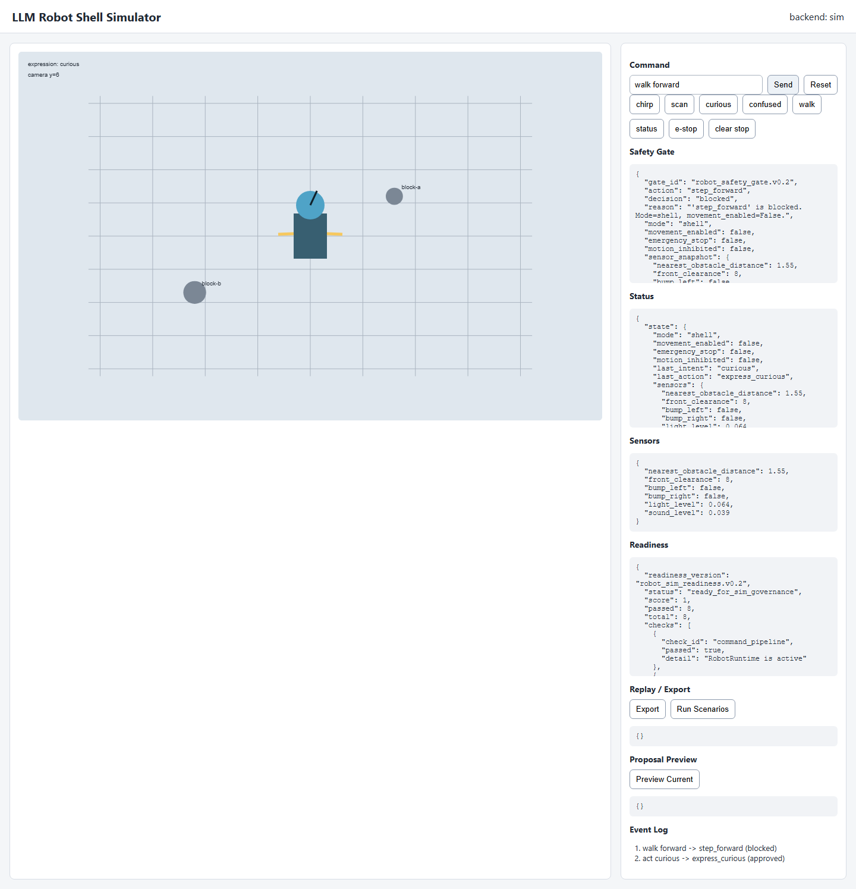

# Governed Robot Shell

**This is an early architecture prototype, not a production robotics safety system.**

Governed Robot Shell is a robot-control shell where language is reduced to a controlled intent, mapped to a finite internal action, checked by a safety gate, and only then sent to a body backend. The core rule is simple: no LLM, chat surface, dashboard, scenario, or parser directly controls motors, GPIO pins, servo channels, actuator angles, or locomotion.

```text
language input
-> intent
-> planned action
-> safety validation
-> body execution
-> logging / state update
```

## Current Status

**Current phase:** Phase 3H - action registry and nonverbal cue kernel.

The project currently includes:

- Shared `RobotRuntime` command pipeline for CLI, API, dashboard, proposals, and scenarios.
- Central finite action registry in `src/brain/action_registry.py`.
- State-aware, config-backed safety checks that fail closed on unknown actions.
- Mock body by default, optional simulator body, and explicit opt-in servo backend skeleton.
- Symbolic nonverbal cue vocabulary only: chirps, blocked/confused/curious/sleepy/alert/wake/idle cues.
- Deterministic simulator world, robot model, observations, and scenario runner.
- Local FastAPI simulator dashboard.
- Append-only JSONL robot event kernel using `robot_event.v0.2`.
- Replay/export, readiness manifest, emergency stop, motion inhibit fields, and review-only proposal previews.
- Pytest coverage for the governed pipeline, safety behavior, simulator backend, API/dashboard hooks, action registry, cues, and preview mode.

Verified locally on 2026-06-11:

```text
27 passed
```

## Screenshots

### Simulator Dashboard



### Governed Command Flow

This capture shows a normal expression command approved through the pipeline and a movement command blocked by the safety gate.



## Quick Start

CLI:

```bash
cd src
python main.py
```

Simulator API and dashboard:

```bash
cd src
python -m uvicorn sim_api:app --reload --port 8787
```

Then open:

```text
http://127.0.0.1:8787/
```

Run tests from the project root:

```bash
python -m pytest
```

## Example Commands

| Command | Intent | Action | Result |
| --- | --- | --- | --- |
| `chirp` | `chirp` | `play_chirp` | approved |
| `look around` | `scan` | `head_turn_left_right` | approved |
| `act curious` | `curious` | `express_curious` | approved |
| `huh` | `confused` | `express_confused` | approved |
| `flutter` | `idle` | `idle_flutter` | approved |
| `wake` | `wake` | `wake` | approved |
| `sleep` | `sleep` | `sleep` | approved |
| `status` | `status` | `report_status` | approved |
| `walk forward` | `move` | `step_forward` | blocked in shell mode |

## Architecture

The system is intentionally layered:

| Layer | Responsibility |
| --- | --- |
| Interface | Accepts text commands from CLI, dashboard, scenarios, or future surfaces. |
| Intent | Converts raw input into a controlled intent label. |
| Planner | Maps intent to one finite action name. |
| Action Registry | Defines action metadata, allowed modes, backend support, movement requirements, and default cue. |
| Safety | Approves or blocks the planned action using config and current `RobotState`. |
| Body | Executes only approved finite actions through mock, sim, or explicit opt-in hardware backend. |
| Audio Cue | Emits symbolic nonverbal cue ids only. Cues never approve or cause action. |
| Event Kernel | Records deterministic append-only simulator-era events for inspection, export, and replay. |

Bad:

```text
LLM -> servo angle
```

Good:

```text
LLM / user input -> intent -> action proposal -> safety gate -> bounded body command
```

## Simulator Surface

Implemented endpoints:

- `GET /`
- `GET /sim/state`
- `POST /sim/command`
- `POST /sim/reset`
- `GET /sim/events`
- `GET /sim/export`
- `POST /sim/replay`
- `GET /sim/scenarios`
- `POST /sim/scenarios/{scenario_id}/run`
- `POST /sim/scenarios/run-all`
- `GET /sim/manifest`
- `GET /sim/readiness`
- `GET /sim/proposals`
- `POST /sim/proposals/preview`
- `POST /sim/proposals/{proposal_id}/approve`
- `POST /sim/proposals/{proposal_id}/reject`

Dashboard commands and scenarios route through `RobotRuntime`; they do not call simulator body, servo code, GPIO, or raw motion APIs directly.

## Safety Notes

The default body is mock-only. The simulator is opt-in through runtime/API construction or `config/body.json`. Real hardware backends remain disabled by default and require explicit config opt-in.

`step_forward` remains blocked unless mode is `mobile`, `movement_enabled` is `True`, emergency stop is clear, motion inhibit is clear, and front-clearance sensor assumptions pass. The simulator backend also refuses `step_forward` directly as a second line of defense.

Locomotion is not part of the current build. The first real hardware target remains expression-only motion such as head yaw, eyelid/wing/flutter servo movement, or other small non-locomotion cues.

## Nonverbal Cues

"Voice" in this project means nonverbal robot cue output only. It does not mean speech, STT, TTS, wake-word handling, or full verbal interaction.

Current cue ids:

- `chirp_ack`
- `chirp_blocked`
- `chirp_confused`
- `chirp_curious`
- `chirp_sleepy`
- `chirp_alert`
- `chirp_wake`
- `chirp_idle`

Mock mode prints cue ids. Sim mode records `latest_audio_cue`, `audio_state`, and `cue_count`.

## Logs

Legacy operator-readable decisions are written to:

```text
data/logs/robot.log
```

Structured simulator-era events are written to:

```text
data/logs/robot_events.jsonl
```

Runtime log files are ignored by Git.
